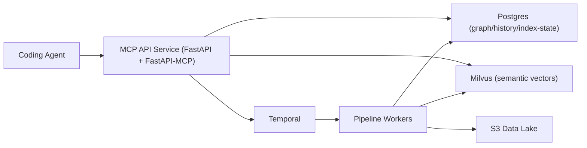

# Lighthouse Architecture

## Goal

Build a cloud-deployed MCP context system with a clear separation between:

- MCP API service (read/control plane)
- Data pipeline service (execution plane)

The MCP service serves tool requests. The pipeline service performs ingestion and indexing work.

## Services and Boundaries

### MCP API service

- Hosts FastAPI + FastAPI-MCP endpoints.
- Exposes tool routes under `/tools/*`.
- Uses route signatures as the canonical MCP tool definitions.
- Reads indexed context from Postgres/Milvus (once implemented).
- Starts and checks indexing workflows (Temporal client integration in-progress).
- Must not execute ingestion/clean/transform/store logic in HTTP request handlers.

### Pipeline worker service

- Runs long-lived Temporal workers.
- Owns execution of indexing workflows and activities.
- Executes ingestion, cleaning, transformation, storage, and mental-model update steps.
- Applies offline data policy:
  - immutable, version-pinned benchmark snapshots
  - incremental append/upsert for rolling scraped sources
  - scheduled synthetic refresh
  - targeted reprocessing only for schema/correction events
- Writes indexing state and job state records (to be implemented).
- Does not serve end-user MCP tool traffic.

## Runtime Topology

## Index Lifecycle Contract (high level)

Index state for a repo/ref is modeled as:

- `NOT_FOUND`
- `PENDING`
- `READY`
- `FAILED`
- `STALE`

MCP tools will eventually gate responses based on this state, rather than assuming data is always ready.

## Source of Truth for MCP Tools

- Canonical: FastAPI route signatures under `mcp/src/routes/tool/`
- Not used: separate static tool spec registry

FastAPI-MCP derives tool exposure from mounted routes.

## Current Repositories/Dirs

- MCP service code: `mcp/`
- Pipeline service code: `pipeline/`
- Design docs: `docs/`
