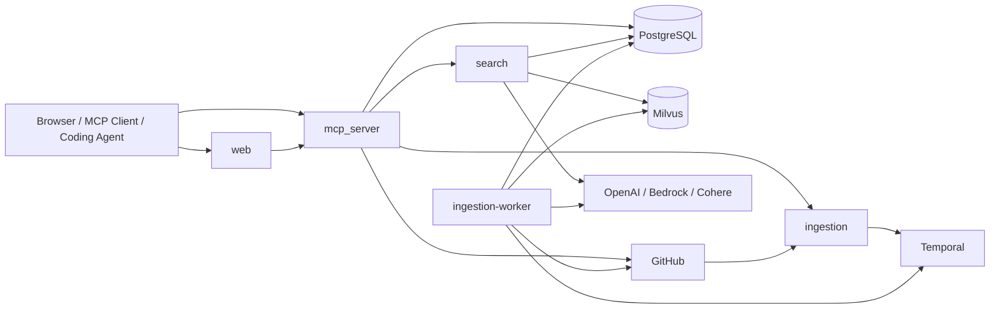

# Lighthouse Architecture

Lighthouse is a multi-service system for repository indexing, semantic retrieval, wiki generation, and agent-facing context delivery. At a high level, the platform separates:

- public entrypoints for users and agents
- internal services for retrieval and indexing control
- background workflow execution for long-running indexing jobs
- stateful storage for relational data and vector search

The architecture is intentionally split so that interactive traffic stays lightweight while ingestion and wiki generation run as durable background work.

## System Overview

The runtime system has five application processes:

- `web`: browser UI for login, repository management, search, and wiki access
- `mcp_server`: main API boundary for browser clients and coding agents; exposes both HTTP routes and MCP tools
- `search`: internal retrieval service for code and wiki search
- `ingestion`: control-plane API for indexing, wiki generation requests, and GitHub webhook intake
- `ingestion-worker`: Temporal worker that executes indexing and wiki workflows

These services depend on:

- PostgreSQL for users, repositories, branch status, chunk metadata, wiki metadata, and token state
- Milvus for vector retrieval over code chunks and wiki content
- Temporal for workflow orchestration and durable execution
- GitHub for OAuth, repository metadata, and push webhooks
- OpenAI and/or AWS Bedrock for embeddings and LLM-backed features
- Cohere for reranking in the search service



## Core Service Responsibilities

### `web`

The frontend is the user-facing shell. It handles the browser experience, but it does not own core business logic. Authentication, repository operations, search, and wiki actions are delegated to backend services through the public edge.

### `mcp_server`

`mcp_server` is the main north-south API boundary for both humans and agents. It serves two protocol surfaces from the same service:

- REST endpoints under `/v1/*`
- MCP tools mounted at `/mcp`

Both surfaces are backed by the same engine layer, so authentication, repository actions, search access, and wiki actions are centralized in one place. This service owns GitHub OAuth, Lighthouse bearer-token issuance, long-lived MCP token lifecycle, and coordination with internal services.

### `search`

`search` is a private retrieval service. It is responsible for serving code and wiki search results by combining relational filtering from PostgreSQL with vector retrieval from Milvus and optional LLM/reranker assistance. In the AWS topology, it is intentionally not exposed through the public load balancer.

### `ingestion`

`ingestion` is the control-plane API for indexing. It accepts explicit indexing and wiki-generation requests from trusted callers and accepts GitHub push webhooks on a public endpoint. Its main job is to validate requests and start or signal Temporal workflows, not to perform heavy indexing work inline.

### `ingestion-worker`

`ingestion-worker` is the execution plane. It polls the Temporal task queue and performs the expensive, long-running work: cloning repositories, chunking and embedding content, publishing indexed results, and generating wiki pages. Splitting the worker from the HTTP service keeps request handling responsive and makes indexing durable across restarts.

## Runtime Topology

### Local Development Topology

Local development is orchestrated with the root [`docker-compose.yml`](../docker-compose.yml). In this shape:

- all services run on the same Docker network
- PostgreSQL, Milvus, `etcd`, `minio`, and a local Temporal dev server run alongside the app services
- service-to-service calls use container DNS names such as `search`, `ingestion`, and `mcp_server`
- `web` can proxy to `mcp_server` for a simpler local browser workflow

This local stack mirrors the production service split, but it keeps all stateful infrastructure nearby for iteration and testing.

```text
Browser -> web -> mcp_server -> search / ingestion
                            -> postgres

ingestion -> temporal (local dev server)
ingestion-worker -> temporal

search -> postgres + milvus
ingestion-worker -> postgres + milvus + GitHub + model providers

milvus -> etcd + minio
```

### AWS Topology

The production-oriented infrastructure under [`infra/`](../infra/) deploys Lighthouse into AWS with a clear split between public edge, private services, and stateful backends.

#### Networking

- One VPC spans public and private subnets across two availability zones.
- An internet-facing Application Load Balancer is the public entrypoint.
- ECS tasks run in private subnets without public IPs.
- A NAT gateway provides outbound internet access for private workloads that still need it.
- VPC endpoints reduce private-subnet dependency on NAT for AWS-native services such as ECR, CloudWatch Logs, and SSM.

#### Public edge routing

The ALB exposes only the paths that must be public:

- default `/` traffic goes to `web`
- `/health`, `/v1/*`, `/mcp`, and `/mcp/*` go to `mcp_server`
- `/webhook` goes to `ingestion`

This means browser traffic and agent traffic enter through `web` or `mcp_server`, while webhook traffic enters through `ingestion`.

#### Compute

AWS compute is split across ECS/Fargate and EC2:

- ECS/Fargate runs `web`, `mcp_server`, `search`, `ingestion`, and `ingestion-worker`
- `search` and `ingestion` are also registered in a private Cloud Map namespace for east-west service discovery
- a dedicated ECS task definition exists for one-off database migrations
- Milvus runs on a dedicated EC2 instance in a private subnet, with `etcd` and `minio` bootstrapped locally on the same host through Docker Compose

#### Stateful services

- PostgreSQL runs on Amazon RDS in private subnets
- Milvus runs on private EC2 and is reachable only from within the VPC
- Temporal is external to the Terraform-managed AWS stack today; the deployment integrates with Temporal Cloud rather than self-hosting Temporal in-cluster

```text
Internet
  -> ALB
     -> web (ECS/Fargate)
     -> mcp_server (ECS/Fargate)
     -> ingestion /webhook (ECS/Fargate)

mcp_server
  -> search.<private-namespace>:8002
  -> ingestion.<private-namespace>:8001
  -> PostgreSQL

search
  -> PostgreSQL
  -> Milvus on private EC2

ingestion + ingestion-worker
  -> Temporal Cloud
  -> PostgreSQL
  -> Milvus on private EC2
  -> GitHub
  -> OpenAI / Bedrock
```

## Key Flows

### 1. User login and session establishment

1. The browser starts the GitHub OAuth flow through `mcp_server`.
2. `mcp_server` redirects the user to GitHub.
3. GitHub redirects back to the OAuth callback on `mcp_server`.
4. `mcp_server` upserts the user, creates Lighthouse bearer-token state, and redirects the browser back to the web client.

The important architectural point is that the frontend does not own auth state creation. Identity and token issuance are centralized in `mcp_server`.

### 2. Repository onboarding and indexing

1. A user or MCP client asks Lighthouse to add a repository or branch through `mcp_server`.
2. `mcp_server` validates the request in the user context and calls `ingestion`.
3. `ingestion` creates or signals a Temporal workflow.
4. `ingestion-worker` executes the workflow and writes relational state to PostgreSQL plus vectors to Milvus.

This separates request acceptance from heavy execution. The synchronous path stays short, while Temporal provides durability and retry semantics for indexing jobs.

### 3. Code and wiki search

1. A browser or coding agent sends a search request to `mcp_server`.
2. `mcp_server` resolves repository/user context and forwards retrieval work to `search`.
3. `search` queries PostgreSQL and Milvus, optionally using model providers for keyword generation or reranking.
4. Results return through `mcp_server` to the browser or MCP client.

The key design choice is that retrieval is isolated in a private service instead of being implemented directly inside the public API layer.

### 4. Wiki generation and retrieval

1. A user triggers wiki generation through `mcp_server`.
2. `mcp_server` calls `ingestion`, which starts a Temporal workflow.
3. `ingestion-worker` generates and stores wiki data.
4. Later read access goes back through `mcp_server`, which serves repository-level wiki retrieval and wiki search via the existing backend services.

Wiki generation is treated as background computation, while wiki access is treated as a normal query path.

### 5. Push-driven incremental reindexing

1. GitHub sends a push webhook to `/webhook`.
2. `ingestion` validates the webhook and starts or signals the incremental indexing workflow.
3. `ingestion-worker` processes the change set and publishes updated indexed state.

This flow keeps GitHub as the source of change events while avoiding direct indexing work on the webhook request path.

## Data and Storage Model

Lighthouse intentionally splits storage by access pattern.

### PostgreSQL

PostgreSQL is the relational system of record. It stores:

- users and authentication/token metadata
- repositories and repository visibility state
- indexed branches and status tracking
- chunk metadata and publish state
- wiki metadata and wiki generation status

Relational state is where Lighthouse tracks ownership, status, lifecycle, and operational metadata.

### Milvus

Milvus stores embedding vectors for retrieval workloads, including separate collections for:

- code chunk embeddings
- wiki content embeddings

Milvus is optimized for nearest-neighbor search, not for lifecycle bookkeeping, which is why it complements rather than replaces PostgreSQL.

### Versioning and publish model

Indexing writes new content versions and search resolves results against the currently active published content. That lets the system update indexed repositories without immediately surfacing stale chunks from previous runs.

## Configuration, Security, and Operations

### Configuration model

Configuration differs by environment:

- local development uses service-level env files and compose wiring
- AWS deployments load per-service JSON configuration from SSM `SecureString` parameters

In AWS, Terraform wires each service to the appropriate SSM parameter name, and the deployment workflow updates those parameter payloads before rolling services forward.

### Trust boundaries

The core trust boundaries are:

- only ALB-exposed routes are public
- `search` stays internal-only in AWS
- service-to-service calls use `INTERNAL_SERVICE_TOKEN`
- user and agent requests use bearer tokens issued by `mcp_server`
- GitHub webhook requests can be authenticated with HMAC validation

This keeps end-user auth, internal auth, and webhook auth as separate concerns with different mechanisms.

### Operational model

Operationally, the system is designed around a small number of independently deployable services:

- stateless HTTP services run as ECS services
- long-running background execution runs in the dedicated `ingestion-worker`
- CloudWatch log groups are provisioned per ECS runtime
- database schema changes run through a one-off ECS migration task using Alembic

This is a pragmatic service split rather than a large microservice mesh. The goal is to isolate concerns that have different scaling and failure characteristics.

## Current Architectural Constraints

The current design reflects deliberate MVP tradeoffs:

- Milvus is a single dedicated EC2 host rather than a managed or multi-node cluster.
- Temporal is externalized to Temporal Cloud in AWS instead of being self-hosted in the VPC.
- `search` is private-only in production, which simplifies the public attack surface but makes `mcp_server` the required gateway for retrieval.
- indexing execution is intentionally split from the ingestion HTTP API to protect interactive traffic from long-running repository work.

Those choices keep the system relatively simple to operate while preserving the separation needed for durable indexing and responsive search.
