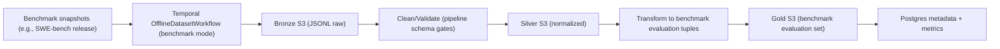

# Dataset Pipeline Plan (Offline + Online)

## Purpose

Define a practical iteration-1 data pipeline that supports:

- runtime MCP retrieval/index freshness
- offline benchmark snapshot ingestion for reproducible evaluation

This document is aligned with:

- `docs/ARCHITECTURE.md`
- `docs/indexing-contract.md`
- `docs/pipeline-service.md`
- `docs/dataset-storage-conventions.md`
- `docs/ideal-datasets.md`

## Scope and Operating Model

- `mcp/` remains the read/control plane.
- `pipeline/` remains the execution plane.
- Pipeline workers are long-running Temporal workers.
- Service runs in cloud and supports local development mode.
- Iteration 1 scope: online runtime indexing + one offline benchmark snapshot workflow.

## Data Platform Design

### Storage layers

- Data lake: S3 + versioned JSON/JSONL artifacts, organized as medallion zones:
  - `bronze`: raw ingested artifacts and source snapshots.
  - `silver`: cleaned/normalized entities with stable schemas.
  - `gold`: training/evaluation datasets and retrieval features.
  - Canonical object-key conventions and run manifest schema are defined in `docs/dataset-storage-conventions.md`.
- Warehouse/serving metadata: Postgres:
  - indexing/job state (`index_jobs`, `index_states`)
  - dataset run metadata, manifests, and quality metrics
- Vector retrieval store: Milvus:
  - embeddings for code/doc chunks used by MCP tools

### Processing/tooling (open source)

- Orchestration: Temporal
- ETL/transforms: Python-native streaming transforms over JSONL artifacts
- Validation: deterministic schema/normalization checks in pipeline activities
- API/data models: Pydantic

## Canonical Data Schemas (v0)

### Indexing/control schemas (online)

Reference contract: `docs/indexing-contract.md`.

- `index_jobs(job_id, workflow_id, repo_id, ref, status, stage, progress_pct, error_code, error_message, created_at, updated_at)`
- `index_states(repo_id, ref, snapshot_sha, status, active_job_id, stale_after, last_indexed_at, updated_at)`

### Dataset schemas (offline)

- `dataset_instances(instance_id, task, repo_id, snapshot_sha, failure_type, failure_ref, corrected_diff_ref, split, created_at)`
- `pipeline_runs(run_id, workflow_type, source_name, status, started_at, finished_at, records_in, records_out, error_code)`
- `quality_metrics(run_id, metric_name, metric_value, metric_context, measured_at)`

For iteration 1, `context_labels` is intentionally deferred to post-iteration work.
For iteration 1, dedicated `repo_snapshots` table materialization is intentionally deferred; equivalent provenance is captured in indexed state, run metadata, and offline manifests.

## Pipeline Workflows

### Online workflow: runtime indexing

Trigger:

- MCP request for a repo/ref with status `NOT_FOUND`, `STALE`, or `FAILED` retry.

Stages:

1. `INGEST` pull repo content and selected metadata.
2. `CLEAN` normalize file metadata and extract text/code units.
3. `TRANSFORM` create retrieval documents/features/embeddings.
4. `STORE` persist Postgres state and Milvus vectors.
5. `MENTAL_MODEL` generate/refresh repo summary artifacts (initially lightweight).

Outputs:

- updated `index_jobs` and `index_states`
- retrieval-ready corpus in Milvus and object artifacts in S3

### Offline workflow (iteration 1): benchmark snapshot curation

Trigger:

- manual run or new benchmark snapshot release.
- manual trigger path implementation: `python -m src.offline_trigger --dataset-name ... --dataset-version ... --dataset-source-path ...`

Adapter input contract (iteration 1):

- `dataset_name`: `swebench` (or alias)
- `dataset_version`: required explicit pin (for example `v1`)
- `dataset_source_path`: required local path to a versioned `.jsonl`/`.json` snapshot file (or versioned directory containing one)

Stages:

1. `INGEST` benchmark snapshot adapter (for example, fixed SWE-bench release).
2. `CLEAN` schema normalize, dedupe, invalid row quarantine.
3. `TRANSFORM` produce canonical benchmark evaluation tuples.
4. `STORE` write bronze/silver/gold outputs and run manifests.
5. `MENTAL_MODEL` skipped in iteration 1 for offline benchmark mode.

Outputs:

- pinned gold benchmark evaluation dataset
- run metadata and quality metrics in Postgres

Deterministic clean/dedupe policy (iteration 1):

- Normalize text fields (newline normalization, trailing-space trim, blank-line collapse).
- Normalize IDs/labels:
  - `repo_id` to lowercase canonical `owner/repo` form where possible.
  - `split` and `failure_type` to stable lowercase token format.
- Validate cleaned rows against `offline-clean-schema/v1`:
  - required non-empty strings (`instance_id`, `task`, `repo_id`, `corrected_diff_ref`, `split`, `failure_type`, dataset identifiers)
  - `repo_id` format check (`owner/repo`)
  - optional `snapshot_sha` check (7-64 lowercase hex chars when present)
- Primary dedupe key: `instance_id`.
  - Deterministic winner selection: explicit `instance_id` source first, then higher completeness score, then longer `corrected_diff_ref`, then lexicographic tie-break.
- Secondary dedupe key: content fingerprint over canonical fields (`repo_id`, `snapshot_sha`, `task`, `corrected_diff_ref`, `failure_ref`, `split`, dataset identifiers).
- Dropped duplicates are emitted to quarantine with explicit reasons and winner references.

### Post-Iteration Updates

- Rolling scraped offline ingestion (incremental issue->PR->diff chains) is implemented.
- Synthetic offline refresh (mutation-repair and related generated datasets) remains deferred.

### Offline recompute policy

- Iteration 1 benchmark snapshots are ingested once, version-pinned, and treated as immutable.
- Full historical recompute is reserved for schema-breaking changes or explicit correction events.
- Post-iteration update: rolling scraped sources now run incremental append/upsert; synthetic refresh remains deferred.

## Pipeline Diagrams

### Offline benchmark snapshot flow (iteration 1)



### Online runtime indexing flow

```mermaid
flowchart LR
  U["MCP tool call"] --> S["Read index_states (Postgres)"]
  S -->| "READY" | R["Serve from Milvus/Postgres"]
  S -->| "NOT_FOUND/PENDING/STALE/FAILED" | T["Temporal RuntimeIndexWorkflow"]
  T --> I["INGEST -> CLEAN -> TRANSFORM -> STORE -> MENTAL_MODEL"]
  I --> J["Update index_jobs/index_states"]
  J --> R
```

## Scheduling Plan and Use Cases

Current implementation includes benchmark snapshot ingestion and rolling scraped ingestion.

| Workflow | Cadence | Primary use case |
| --- | --- | --- |
| RuntimeIndexWorkflow | Event-driven (on demand) | Ensure MCP can serve current context for active repos |
| OfflineDatasetWorkflow (benchmark snapshots) | Manual or on new benchmark release | Import and normalize immutable benchmark snapshots for reproducible baselines |
| OfflineDatasetWorkflow (rolling issue->PR->diff) | Daily (or manually bounded) | Incrementally ingest new issue/PR/diff chains with watermark and upsert controls |
| Evaluation refresh jobs | Monthly or on snapshot update | Recompute fail-to-pass and regression trends on pinned benchmark data |

Monthly evaluation refresh trigger path implementation:

- `python -m src.evaluation_refresh_trigger --dataset-name ... --dataset-version ... --cron-schedule "0 0 1 * *"`
- Baseline metrics emitted per run: `baseline.fail_to_pass_rate`, `baseline.regression_rate` (stored in `quality_metrics`).

## Initial Implementation TODO (v0)

1. Finalize canonical shared enums and payload shapes from `docs/indexing-contract.md`.
2. Implement persistence for `index_jobs` and `index_states`.
3. Implement Temporal activity logic for ingest/clean/transform/store/mental-model stages.
4. Add connectors for GitHub, S3, Postgres, Milvus.
5. Define S3 bronze/silver/gold path conventions and run manifests.
6. Add schema validation gates and invalid-row quarantine behavior.
7. Implement first offline adapters:
   - SWE-bench snapshot ingestion (version-pinned, immutable)
8. Implement MCP index-control integration (start/status/retry) with state-aware responses.
9. Add monthly evaluation refresh job wiring for pinned benchmark snapshots.
10. Add correlation IDs and structured logs across MCP and pipeline services.
11. Add integration tests for one successful runtime index and one failure/retry path.
12. Add config provider with AWS Parameter Store values and local `.env` fallback.

## Non-v0 Features (Roadmap)

- Synthetic mutation-repair dataset generation at scale.
- High-confidence `missing_context` label generation pipeline (beyond weak labels).
- Learned retrieval ranking model trained on offline gold datasets.
- Advanced data quality monitoring (drift and freshness scorecards).
- Cost-aware scheduling and queue prioritization policies.
- Human-in-the-loop labeling/feedback loops for difficult failure modes.

## Notes on Source Prioritization

Based on `docs/ideal-datasets.md` reality check:

- Iteration 1 prioritizes SWE-bench benchmark snapshots for reproducible baseline evaluation.
- Rolling GitHub issue/PR mining ingestion is now supported; synthetic pipelines remain deferred.
- Treat very large ecosystem datasets as targeted inputs, not full-ingestion v0 scope.
